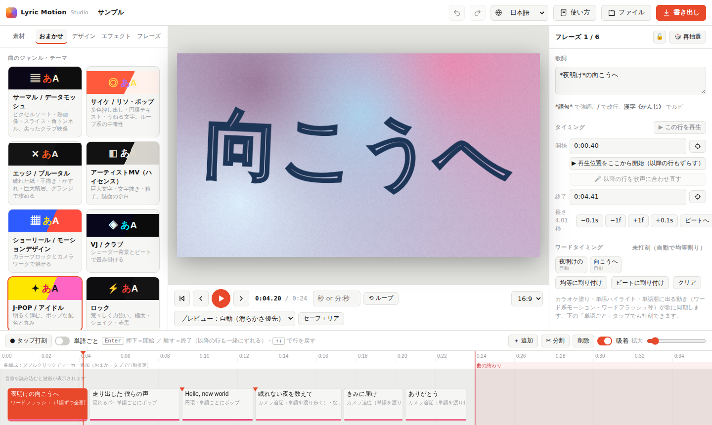

# Lyric Motion Studio

**歌と歌詞から、キネティック・タイポグラフィの歌詞動画（リリックビデオ）をブラウザーだけで作るツール。**
A browser-only kinetic-typography lyric video maker. [English below ↓](#english)



▶ **今すぐ使う：https://reekoby.github.io/lyric-motion-studio/**（インストール不要・無料）

---

## できること

- **自動配置** — 🎤 歌声を解析して、行と単語のタイミングを自動で合わせる（ブラウザー内処理）。タップ打刻・ビート吸着・クオンタイズで仕上げ
- **おまかせ演出** — 24のジャンル・テーマから、配色・書体・レイアウト・動き・トランジション・背景モーションを曲構成に合わせて自動生成。激しさ・動きの付け方・変化の多さも調整可能
- **豊富なモーション** — 約280種の登場／保持／強調／退場モーション（強さ・ばらつき・スプリングなどを行ごとに調整。ペン書き・手書き・原稿用紙・水・変形・ボカロPV風など）、37種のレイアウト、52種のトランジション、120種以上の背景モーション（GPUシェーダー含む）、約100種のエフェクト、約100書体
- **美しい文字組み** — 和欧混植（欧文書体の自動ペアリング、ベースライン・大文字高さの調整、和欧間、約物詰め）、縦組み、ルビ、字間・単語間の手動調整
- **背景画像・動画** — 複数の写真やMP4/WebMを、19種のトランジションで自動／手動切り替え
- **多言語** — 画面表示：日本語・English・Español・Italiano・한국어。歌詞も各言語に対応（ハングル書体20種）
- **書き出し** — MP4 / MOV / WebM / 透過WebM / PNG連番 / GIF、23.976〜60fps、モーションブラー、字幕（SRT / WebVTT / LRC）、YouTubeチャプター

## 使い方

1. https://reekoby.github.io/lyric-motion-studio/ を開く（Chrome または Edge の最新版を推奨）
2. 「素材」タブで音源と歌詞を入れ、**🎤 歌声に合わせて自動配置**
3. 「おまかせ」タブでテーマを選ぶ → 「書き出し」

アプリ内の **「使い方」** に詳しい説明書（5言語）があります。

**オフラインで使う**：このリポジトリの [`index.html`](index.html) をダウンロードしてブラウザーで開くだけで動きます（書体の読み込みのみネット接続が必要）。

### 動作環境
- 推奨：デスクトップ版 Chrome / Edge（動画の書き出しに WebCodecs を使用）
- Firefox / Safari は一部の書き出し形式に対応していない場合があります

## プライバシー

音源・歌詞・画像・動画は**どこにも送信されません**。解析と書き出しはすべてお使いのブラウザー内で行い、データはそのブラウザーの中だけに保存されます。外部への通信は書体の読み込み（Google Fonts）のみです。アクセス解析・広告・Cookie はありません。詳しくは [PRIVACY.md](PRIVACY.md) をご覧ください。

## 権利についてのお願い

本ツールで作った動画に使う**楽曲・歌詞・画像・動画の権利**は、利用者ご自身でご確認ください。他人の作品を公開する場合は、権利者の許諾や、配信プラットフォームの規約・利用許諾の範囲内でご利用ください。本ツールは MIT ライセンスに基づき「現状のまま」提供され、利用によって生じた損害について作者は責任を負いません。

## ソースからビルド

```bash
npm ci
npm run build      # → dist/lyric-motion-studio.html（公開用 index.html と同じもの）
```

`src/` のモジュールを `build.mjs` が1つの HTML にまとめます（依存ライブラリも同梱、外部スクリプトなし）。構成と設計のメモは [docs/DEVELOPMENT.md](docs/DEVELOPMENT.md) にあります。

## ライセンス

- 本ツール：[MIT License](LICENSE) © 2026 ΛNTRΞC
- 同梱ライブラリ：Mediabunny（MPL-2.0）、gifenc（MIT）— [THIRD_PARTY_NOTICES.md](THIRD_PARTY_NOTICES.md)
- 書体：Google Fonts から実行時に読み込み（主に SIL Open Font License）

不具合の報告・要望は Issues へ。セキュリティ上の問題は [SECURITY.md](SECURITY.md) の方法でお知らせください。

---

## English

**Make kinetic-typography lyric videos from a song and its lyrics — entirely in your browser.**

▶ **Open the app: https://reekoby.github.io/lyric-motion-studio/** (free, nothing to install)

### Features
- **Auto-timing from vocals** — analyses the singing to time every line and word (on your device); refine with tap timing, beat snapping and quantize
- **Auto direction** — 24 genre themes generate colours, fonts, layouts, motion, transitions and background motion that follow the song structure; adjust intensity, motion feel and variety
- **Motion library** — ~280 enter/hold/emphasis/exit motions with per-phrase intensity, variation and spring easing (incl. pen writing, handwriting, manuscript paper, water, morphing, Vocaloid-PV style), 37 layouts, 52 transitions, 120+ background motions (incl. GPU shaders), ~100 effects, ~100 typefaces
- **Typography** — mixed Japanese/Latin typesetting (auto Latin pairing, baseline and cap-height matching), vertical text, ruby, manual tracking and word spacing
- **Background images & videos** with 19 crafted transitions
- **UI in 日本語 / English / Español / Italiano / 한국어**, lyrics in all of them (20 Hangul typefaces)
- **Export** MP4 / MOV / WebM / transparent WebM / PNG sequence / GIF at 23.976–60 fps with motion blur, plus SRT / WebVTT / LRC and YouTube chapters

### Privacy
Your audio, lyrics, images and videos are **never uploaded**. Everything is processed and stored in your browser. The only network access is loading fonts from Google Fonts. No analytics, ads or cookies. See [PRIVACY.md](PRIVACY.md).

### Your content
You are responsible for having the rights to the music, lyrics, images and videos you use. The software is provided "as is" under the MIT License, without warranty.

### Build
`npm ci && npm run build` → `dist/lyric-motion-studio.html`

### License
[MIT](LICENSE) © 2026 ΛNTRΞC · bundled: Mediabunny (MPL-2.0), gifenc (MIT) — see [THIRD_PARTY_NOTICES.md](THIRD_PARTY_NOTICES.md)
